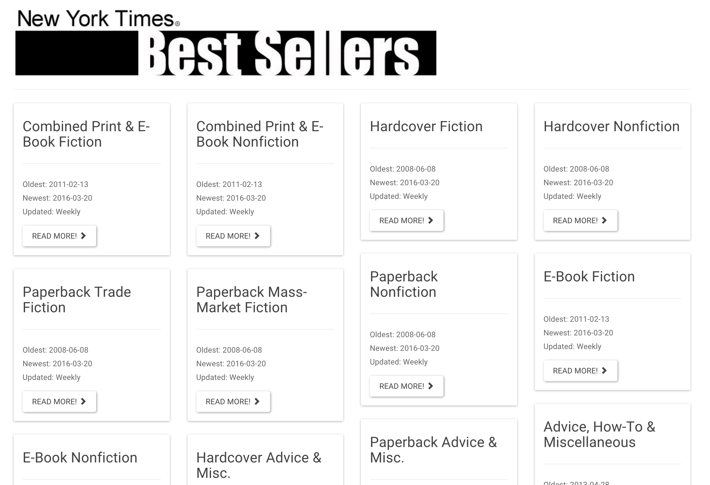

# Clase 14

### 3techfest


- [Web](https://t3chfest.uc3m.es/2017/?lang=es)

### Closures

**Closures**
> Los closures son funciones que manejan variables independientes. En otras palabras, la función definida en el closure "recuerda" el entorno en el que se ha creado.

> No es aconsejable crear innecesariamente funciones dentro de otras funciones si no se necesitan los closures para una tarea particular ya que afectará negativamente el rendimiento del script tanto en consumo de memoria como en velocidad de procesamiento.
> [Closures MDN](https://developer.mozilla.org/es/docs/Web/JavaScript/Closures)

- Fábrica de función:
    ```javascript
	function sumador(x) {
	  return function(y) {
	    return x + y;
	  };
	}

	var sum1 = sumador(10); //Closure
	var sum2 = sumador(30);	//Closure

	console.log(sum1(2)); // Devuelve 12
	console.log(sum2(2)); // Devuelve 32
	console.log(sumador(20)(2)); //Devuelve 22
    ```

- Otro ejemplo... más útil:
    ```javascript
      var varGlobal = "Soy un dato Global";
      var burbuja;

      function nivel1() {
        var varInterna = "Soy un dato interno. -> nivel1";

        function nivel2() {
          console.log("Estoy dentro de la funcion -> nivel2")
          console.log("Estoy dentro de la funcion -> nivel2 y puedo acceder al nivel1: "+varInterna)
        }

        burbuja = nivel2;

      }

      nivel1();

      burbuja();
      console.log("Burbuja recuerda su contexto original")
    ```
- Ejemplo de w3school:
    ```
        var add = (function () {
            var counter = 0;
            return function () {return counter += 1;}
        })();
        
        add();
        add();
    ```


### Ejercicios

**1 -** Utilizando la [API del NYTimes](http://developer.nytimes.com/docs) vamos a crear una web que nos muestre los libros más vendidos de la [categoria Hardcover Fiction](http://www.nytimes.com/best-sellers-books/2016-01-17/hardcover-fiction/list.html)


**Especificaciones:**
- [Consigue tus credenciales dandote de alta](https://myaccount.nytimes.com/auth/login?URI=http:/developer.nytimes.com/login/external)
- Debes incluir una animación mientras esperamos la carga del contenido.
- Los libros deben estar organizados según el orden de la lista oficial
- Debes incluir la carátula del libro
- Debes incluir la cantidad de semanas que lleva en la lista
- Debes incluir la descripción
- Debes incluir el titulo y la posición que ocupa en la lista ( #1 titulo.... #2 titulo....)
- Debes incluir el link para poder comprar el libro en amazon (debe abrirse en otra pestaña)

**Trucos:**
- Mira en detalle la [documentación oficial](http://developer.nytimes.com/docs)
- Usa el *[Books API](http://developer.nytimes.com/docs/books_api/)*

```javascript
	// Tu solución!
```

**Concepto:**


**2 -** Refactorizaremos el ejercicio anterior para ofrecer al cliente un dashboard con la listas disponibles en *[Books API](http://developer.nytimes.com/docs/books_api/)*.
**Especificaciones:**
- Debes incluir una animación mientras esperamos la carga del contenido.
- Al cargar la web deben de aparecer todas las listas con los siguientes datos:
	- Nombre completo de la lista
	- La fecha del libro más antiguo en la lista
	- La fecha del libro ultimo incorporado
	- La frecuencia de actualización
	- Un link para poder cargar la lista.
- Al pinchar en el link de una lista especifica el DOM debe cambiar e incluir los siguientes datos:
- Un bontón para *volver atras* y recargar la disposición anterior
- Los libros deben estar organizados según el orden de la lista oficial
- Debes incluir la carátula del libro
- Debes incluir la cantidad de semanas que lleva en la lista
- Debes incluir la descripción
- Debes incluir el titulo y la posición que ocupa en la lista ( #1 titulo.... #2 titulo....)
- Debes incluir el link para poder comprar el libro en amazon (debe abrirse en otra pestaña)

```javascript
	// Tu solución!
```

**Concepto:**
- Dashboard:



- Dentro de una lista:


### Proyectos Personales

Es hora de poner en práctica todo lo aprendido con un proyecto personal.

- **Funcionamiento:**
	- Usaremos los [issues de nuestro repositorio](https://github.com/Fictizia/Curso-JS-para-desarrolladores-web_ed7/issues) para coordinar todas las dudas que tengais.
	- Crearemos un nuevo repositorio en Github para desarrollar el proyecto.
- **Entrega:**
	- Abril (Fecha por concretar)
